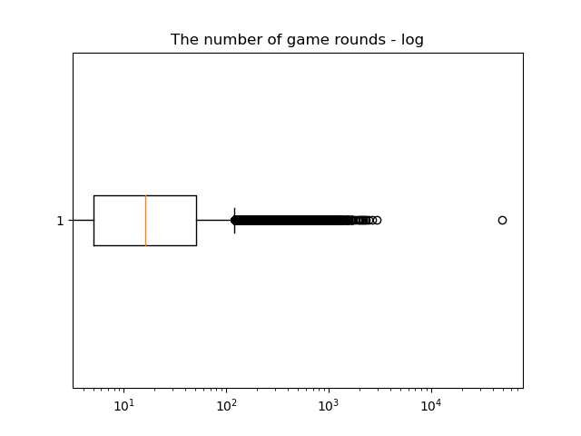

Cookie Cats - популярная мобильная головоломка, разработанная компанией Tactile Entertainment. Это классическая головоломка в стиле "три в ряд", в которой игрок должен соединить плитки одного цвета, чтобы очистить поле и выиграть уровень.

По мере прохождения игры игроки будут сталкиваться с баннером, который заставит их подождать некоторое время, прежде чем они смогут продвинуться дальше или совершить покупку в приложении. 

Задача - проанализировать результаты A/B-теста, в ходе которого первый баннер в Cookie Cats были перенесены с 30-го на 40-й уровень. 

В данных присутствует метрика Retention 1 дня, Retention 7 дня и количество пройденных уровней.

Этот тест явно проектировался для проверки метрики Retention, но я хочу проверить среднее количество пройденых уровней выбрав ttest или mannwhitneyu.


Если посмотреть на график BoxPlot с логарифмированной осью x, можно заметить что распределение имеет жирный правый хвост. В таких случаях ttest не подходит потому, что не выполняется требование о нормальности распределений выборочных средних. Если же все таки применить его, то мы получим случаное значение alpha и power для таких данных. 



Критерий Манна-Уитни здесь более предпочтительнее потому, что он не обращает внимание на распределение, а использует ранги и может обеспечить нужное значение alpha и power при заданом mde. Нужно только правильно рассчитать размеры выборок.


Функция mannwhitneyu из пакета scipy, помимо p-value возвращает еще U статистику. При разных гипотезах p-value, который зависит от U статистики, считается по разному.

Вот код из функции [mannwhitneyu](https://github.com/scipy/scipy/blob/de80faf9d3480b9dbb9b888568b64499e0e70c19/scipy/stats/_mannwhitneyu.py#L475), который выбирает нужную статистику.

```
if alternative == "greater":
    U, f = U1, 1  # U is the statistic to use for p-value, f is a factor
elif alternative == "less":
    U, f = U2, 1  # Due to symmetry, use SF of U2 rather than CDF of U1
else: # alternative == "two-sided"
    U, f = np.maximum(U1, U2), 2  # multiply SF by two for two-sided test
``` 

При выборе альтернативной гипотезы "greater", критерий берет статистику выборки A и проверяет как часто (p-value) сумма рангов выборки А будет больше суммы рангов выборки B. 

При альтернативной гипотезы "less", критерий берет статистику выборки B и проверяет как часто сумма рангов выборки B будет больше суммы рангов выборки A. Или сформулировав по другому, как часто сумма рангов выборки А будет меньше(!) суммы рангов выборки B.

При формировании гипотезы и анализе AB теста нужно учитывать этот факт.

```
Гипотеза H0: Первый баннер на 30 уровне в среднем имеет такое же количество пройденых уровней, как и первый банер на 40 уровне.
H1: Первый баннер на 30 уровне в среднем имеет меньшее количество пройденых уровней на n значений, чем первый банер на 40 уровне.

alpha - 0.05
power - 0.8
```

```
Cумма рангов
R_a = 2023398600.5 # выборка A
R_b = 2043674354.5 # выборка B
```


U статистика считается по формуле 

$$ U_i = {R_i - {n_i(n_i + 1) \over 2}} $$

*где n размер выборки, i индекс выборки*


$$ U_a = {2023308411.5 - {44699(44699 + 1) \over 2}} = 1024285761.5$$

$$ U_b = {2043674354.5 - {45489(45489 + 1) \over 2}} = 1009027049.5$$

Для нормализации U статистики и получения p-value нужно воспользоваться формулой 

$$ z = {{U - {n_a n_b}\over2 }\over\sqrt{n_a n_b(n_a+n_b+1)\over12}} $$

$$ z = {{1009027049.5- {44699 * 45489}\over2 }\over\sqrt{44699 * 45489(44699+45489+1)\over12}} = -1.9536 $$

```
Для получения вероятности получить такую либо большую статистику воспользуемся функцией norm из пакета scipy

pval = 1 - norm.cdf(-1.9536) = 0.9746

p-value > alpha

Вывод: H0 не отвергаем или первый баннер на 30 уровне в среднем имеет такое же количество пройденых уровней, как и первый банер на 40 уровне.
```
